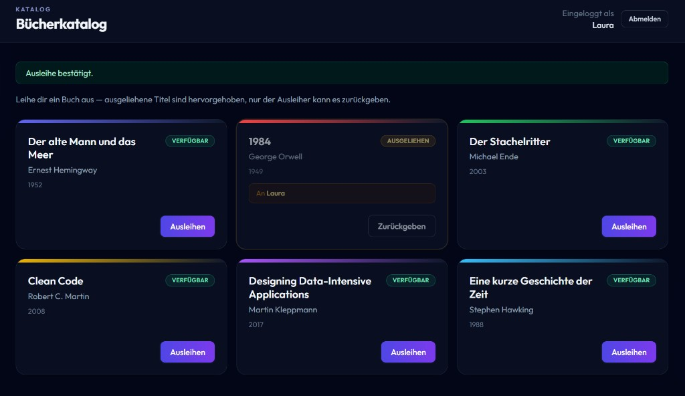

# 🛡️ Secure Java Enterprise Boilerplate (DevSecOps Focus)

> Spring Boot 3 · Java 21 · OWASP SCA · SonarQube SAST · Trivy · Gitleaks · Hardened Docker

[](https://github.com/Jsplice/Spring-security/actions/workflows/devsecops-pipeline.yml)

---

## Library App

A small but fully functional web application bundled with the boilerplate to demonstrate a secured, stateful Spring Boot feature beyond a plain REST endpoint.



### Features at a glance

| Feature | Detail |
|---|---|
| **Name-only login** | Enter any name — no password required. Spring Security creates a session-scoped `READER` principal on the fly. |
| **Live book catalog** | Six pre-seeded titles, rendered as cards with a coloured accent bar per book. |
| **Borrow / Return** | One click borrows a book and marks it `AUSGELIEHEN`; only the borrower sees the *Zurückgeben* button. |
| **Availability badge** | Cards show `VERFÜGBAR` (green) or `AUSGELIEHEN` (amber) at a glance. |
| **Borrower tag** | Borrowed cards display a highlighted "An \<name\>" label so everyone can see who has the book. |
| **Persistent within session** | State is kept in an H2 in-memory database — restarting the container resets all loans. |

Open [http://localhost:8080](http://localhost:8080) after `docker compose up -d`, enter your name, and start borrowing.

---

## Pipeline Overview

Every push to `main` and every Pull Request triggers a fully automated security pipeline. Results are visible at a glance in three places:

| Where | What you see |
|---|---|
| **Actions tab → Run → Summary** | Markdown table: pass/fail per stage + coverage % |
| **Security tab → Code scanning alerts** | All CVEs and secrets, filterable by tool and severity |
| **Pull Request → Files changed** | Inline annotations on the exact lines with findings |

### Pipeline Stages

```
Push / PR
    │
    ▼
[1] Build & Test ──────────────────── mvn verify + JaCoCo coverage
    │
    ├──▶ [2] SCA — OWASP Dependency-Check   CVEs in Maven deps → SARIF → Security tab
    │
    ├──▶ [3] Container Scan — Trivy         CVEs in Docker image → SARIF → Security tab
    │
    └──▶ [4] Secret Scan — Gitleaks         Hardcoded secrets in git history → job fails on finding
              │
              ▼
         [5] SAST — SonarQube               Code quality gate (runs as service container)
              │
              ▼
         Job Summary (pass/fail table)
```

### Required GitHub Secrets

Before the first pipeline run, add the following in **Settings → Secrets and variables → Actions**:

| Secret | How to get it |
|---|---|
| `NVD_API_KEY` | Free key from [nvd.nist.gov/developers/request-an-api-key](https://nvd.nist.gov/developers/request-an-api-key) — required by OWASP Dependency-Check to query the NVD without hitting rate limits |

SonarQube runs as a service container inside the GitHub Actions runner and auto-provisions its own ephemeral analysis token — no additional secret needed for that stage.

---

## Professional Background & Motivation

Since 2019, my professional work has been conducted almost exclusively within NDA-protected enterprise environments. The nature of that work — spanning financial services, regulated industries, and large-scale distributed systems — means that production codebases, architectural decisions, and security implementations cannot be publicly shared.

This repository exists as a **technical showcase** to demonstrate hands-on expertise in three key areas that define modern enterprise Java engineering:

| Area | What this repo demonstrates |
|---|---|
| **Refactoring & Clean Architecture** | Layered package structure, single-responsibility controllers, externalized configuration |
| **Code Quality** | SonarQube integration, enforced quality gates, structured code conventions |
| **Security Engineering** | Software Composition Analysis (SCA) via OWASP Dependency-Check, hardened container builds, non-root runtime, minimal base images |

This boilerplate represents the *kind* of baseline I establish at the start of any greenfield enterprise project — not a toy app, but an opinionated foundation that treats security as a first-class citizen from day one.

---

## Tech Stack

| Component | Technology |
|---|---|
| Language | Java 21 (LTS) |
| Framework | Spring Boot 3.2 |
| Build tool | Apache Maven 3.9 |
| SCA (dependency scanning) | OWASP Dependency-Check 12.x |
| SAST / Code Quality | SonarQube Community |
| Containerisation | Docker (multi-stage), Docker Compose |
| Runtime image | `eclipse-temurin:21-jre` (minimal footprint) |

---

## Project Structure

```
.
├── src/
│   ├── main/
│   │   ├── java/com/example/secureapi/
│   │   │   ├── SecureApiApplication.java        # Bootstrap entry point
│   │   │   ├── SecureApiController.java         # REST /api/v1/status
│   │   │   ├── config/
│   │   │   │   ├── SecurityConfig.java          # Spring Security (name-only login)
│   │   │   │   └── LibraryDataSeeder.java       # Seed books on startup
│   │   │   └── library/
│   │   │       ├── domain/Book.java             # JPA entity
│   │   │       ├── repo/BookRepository.java     # Spring Data repository
│   │   │       ├── service/LibraryService.java  # Borrow / return logic
│   │   │       └── web/
│   │   │           ├── PageController.java      # / and /login routes
│   │   │           └── BookController.java      # /books routes
│   │   └── resources/
│   │       ├── application.properties
│   │       └── templates/
│   │           ├── login.html
│   │           └── books.html
│   └── test/java/com/example/secureapi/
│       └── SecureApiControllerTest.java         # @WebMvcTest for /api/v1/status
├── .github/workflows/devsecops-pipeline.yml     # 5-stage CI/CD pipeline
├── docs/screenshot-library.png
├── Dockerfile                                   # Multi-stage, non-root build
├── docker-compose.yml                           # API + SonarQube services
├── owasp-suppressions.xml                       # CVE false-positive suppressions
├── pom.xml                                      # Spring Boot 3, OWASP, JaCoCo
└── README.md
```

---

## Quick Start

### Prerequisites

- [Docker Desktop](https://www.docker.com/products/docker-desktop/) installed and running

> Java 21 and Maven are **not required locally** — all build, test, and scan steps run inside Docker containers.

---

### 1. Run the full stack with Docker Compose

```bash
docker compose up -d
```

This will:
1. Build the application JAR inside a Maven container (Stage 1).
2. Package it into a minimal JRE runtime image (Stage 2).
3. Start the **SonarQube** server at [http://localhost:9000](http://localhost:9000).
4. Start the **Spring Boot API** at [http://localhost:8080](http://localhost:8080).

> **Note:** SonarQube requires `vm.max_map_count >= 262144` on Linux hosts.
> Run: `sudo sysctl -w vm.max_map_count=262144`

Verify the API is live:

```bash
curl http://localhost:8080/api/v1/status
curl http://localhost:8080/actuator/health
```

---

### 2. Software Composition Analysis — OWASP Dependency-Check

Scans all Maven dependencies against the [National Vulnerability Database (NVD)](https://nvd.nist.gov/).
The build **fails automatically** if any dependency has a CVE with a CVSS score ≥ 7.

Because Maven is not required locally, run the scan inside Docker:

```bash
docker run --rm \
  -v "$(pwd):/build" \
  -w /build \
  maven:3.9-eclipse-temurin-21 \
  mvn dependency-check:check -B -Dformats=ALL
```

Reports are generated at:

```
target/dependency-check-report/dependency-check-report.html   ← human-readable
target/dependency-check-report/dependency-check-report.sarif  ← Security tab
target/dependency-check-report/dependency-check-report.json   ← machine-readable
```

To suppress a confirmed false positive, add a documented entry to `owasp-suppressions.xml`.

---

### 3. Static Analysis — SonarQube Scan

Once SonarQube is running locally (via Compose), generate a token and run the scanner.

#### Generate a token

1. Open [http://localhost:9000](http://localhost:9000) and log in (`admin` / your password)
2. Top-right avatar → **My Account** → **Security** tab
3. Under **Generate Tokens**: name it anything, type = **Global Analysis Token**, click **Generate**

#### Run the scan

Because Maven is not required locally, the scan runs inside the same Docker image used to build the app. This keeps the local machine dependency-free.

> **Important for Windows / PowerShell users:** wrap the `mvn` call in `sh -c "..."` to prevent PowerShell from misinterpreting the `-D` property flags.

```bash
docker run --rm \
  --network spring-security_default \
  -v "$(pwd):/build" \
  -w /build \
  maven:3.9-eclipse-temurin-21 \
  sh -c "mvn compile sonar:sonar \
    -Dsonar.projectKey=secure-api \
    -Dsonar.host.url=http://sonarqube:9000 \
    -Dsonar.token=<YOUR_GLOBAL_ANALYSIS_TOKEN> \
    -Dsonar.scm.disabled=true \
    -B"
```

> **Note:** the host URL inside Docker is `http://sonarqube:9000` (the Compose service name), not `localhost:9000`.

Then open [http://localhost:9000/dashboard?id=secure-api](http://localhost:9000/dashboard?id=secure-api) to review:
- Code smells
- Bug detections
- Security Hotspots
- Duplications
- Test coverage (JaCoCo is already configured in `pom.xml`; reports appear under `target/site/jacoco/`)

---

### 4. Tear down

```bash
docker compose down -v
```

The `-v` flag removes the named volumes, giving you a clean SonarQube state on the next run.

---

## Security Design Decisions

### Container Hardening

| Practice | Implementation |
|---|---|
| Non-root execution | `useradd --system appuser` + `USER appuser` |
| Minimal attack surface | Runtime stage uses `eclipse-temurin:21-jre`, not a full JDK |
| No build tools in production | Multi-stage build discards Maven, source code, and intermediate layers |
| Explicit file ownership | `chown appuser:appgroup app.jar` before privilege drop |

### Dependency Security

| Practice | Implementation |
|---|---|
| Automated CVE scanning | `dependency-check-maven` plugin bound to the build lifecycle |
| Fail-fast on high severity | `<failBuildOnCVSS>7</failBuildOnCVSS>` |
| Documented suppressions | All false positives recorded in `owasp-suppressions.xml` with reviewer, date, and justification |

---

## License

MIT — feel free to use this as a starting point for your own enterprise projects.
